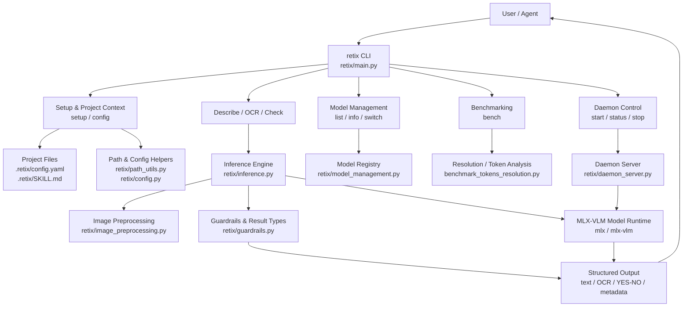

# RETIX

[](https://pypi.org/project/retix/)
[](https://pypi.org/project/retix/)
[](https://github.com/SNiPERxDD/retix/releases)
[](LICENSE)

RETIX is a local-first vision CLI for agents that need to inspect screenshots, extract visible text, and verify visual claims with deterministic output. It is built around a simple idea: keep the workflow close to the codebase, keep the defaults predictable, and expose enough control for engineering use without forcing a heavier application layer.

## What RETIX Does

RETIX currently provides four primary capabilities:

- `describe` for structured screenshot analysis
- `ocr` for text extraction
- `check` for YES/NO claim verification with confidence
- `daemon` for keeping the model warm across repeated requests

It also includes first-class project initialization, model management, and benchmarking commands so the CLI can be used both interactively and as part of automated workflows.

## Install

### Recommended: PyPI

```bash
uv pip install retix
```

If you prefer standard pip, this also works:

```bash
pip install retix
```

`uv` resolves this dependency graph much faster than pip in practice, especially because RETIX depends on ML packages such as `torch`, `torchvision`, `mlx`, and `mlx-vlm`.

### From Source

```bash
git clone https://github.com/SNiPERxDD/retix.git
cd retix
python3 -m pip install -e .
```

## Quick Start

```bash
retix setup
retix describe screenshot.png
retix ocr document.png
retix check image.png "button is visible"
```

If you run `retix` with no arguments, the CLI prints the help screen.

## Architecture

RETIX keeps the control flow simple: the CLI routes requests, the project layer resolves local state, inference runs through the model stack, and the daemon path keeps the model warm for repeated requests.



This layout mirrors the codebase: `retix/main.py` owns routing, `retix/project_config.py` handles project-local state, `retix/inference.py` and `retix/image_preprocessing.py` own the vision path, and `retix/daemon_server.py` provides the warm-process mode.

## Command Reference

### Screenshot Analysis

```bash
retix describe <image>
retix describe <image> --prompt "focus on buttons"
retix describe <image> --json
```

### OCR

```bash
retix ocr <image>
retix ocr <image> --json
```

### Claim Verification

```bash
retix check <image> "submit button is visible"
retix check <image> "error banner is red" --json
```

### Project Setup

```bash
retix setup
retix setup --non-interactive
retix config
```

`retix setup` validates the environment, creates the local cache virtual environment under `~/.cache/retix/venv` when needed, and selects a model tier based on the machine.

`retix config` creates the project context in `.retix/` and keeps the repository ignore rules aligned with RETIX artifacts.

### Model Management

```bash
retix model list
retix model info
retix model switch 2b
retix model switch 8b
retix model switch moe
```

### Benchmarking

```bash
retix bench
```

### Daemon

```bash
retix daemon start
retix daemon status
retix daemon stop
```

`retix daemon stop` sends `SIGTERM`, waits for graceful shutdown, escalates to `SIGKILL` if necessary, and removes stale PID/socket files.

## Project Files

RETIX keeps project-local state in:

```text
.retix/
  SKILL.md
  config.yaml
```

The generated skill file is designed for agent integration and uses a minimal metadata header with `ID`, `Name`, and `Version`.

## Performance Notes

RETIX includes two built-in optimizations that matter in practice:

- High-resolution images are automatically downscaled before inference when needed.
- The CLI uses task-specific token limits rather than one fixed ceiling for every command.

The repository also includes `benchmark_tokens_resolution.py` for comparing token budgets and image resolutions.

## Testing

```bash
pytest tests
```

For the real-world image suite:

```bash
RETIX_RUN_REAL_WORLD=1 pytest tests/real_world -m real_world
```

## Troubleshooting

### Torch Installation Feels Stuck

If `pip install retix` appears to hang while resolving `torch`, use `uv`:

```bash
uv pip install retix
```

In practice, `uv` resolves and installs RETIX far faster than pip for this dependency set.

If `uv` is not installed:

```bash
brew install uv
```

### Need a Known-Good Install Path

If you want to avoid the resolver entirely, install the project from source:

```bash
git clone https://github.com/SNiPERxDD/retix.git
cd retix
python3 -m pip install -e .
```

## License

MIT License.
